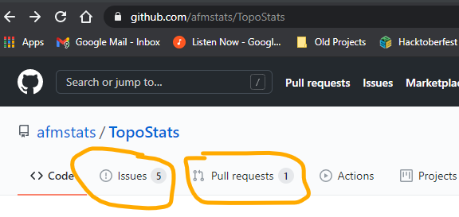
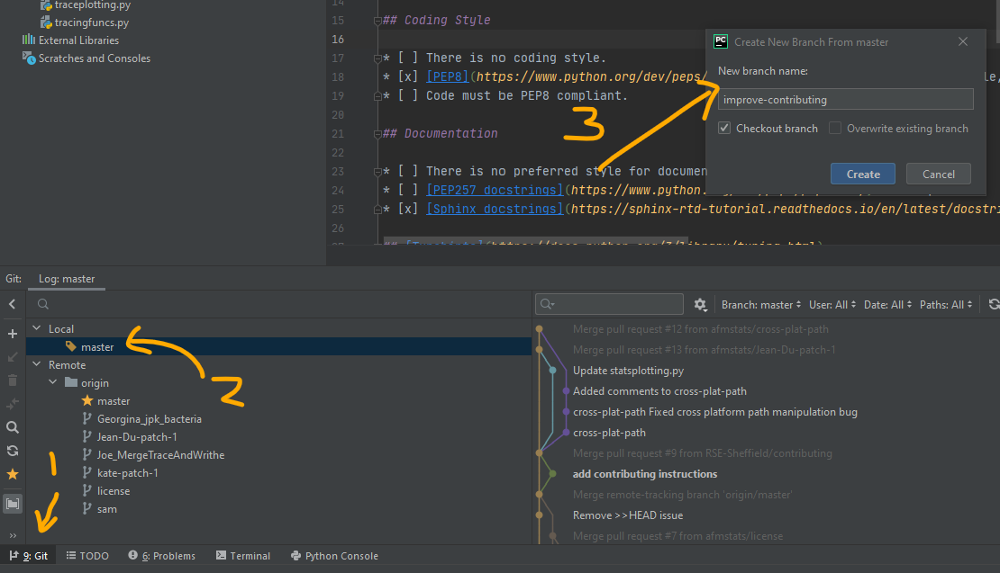
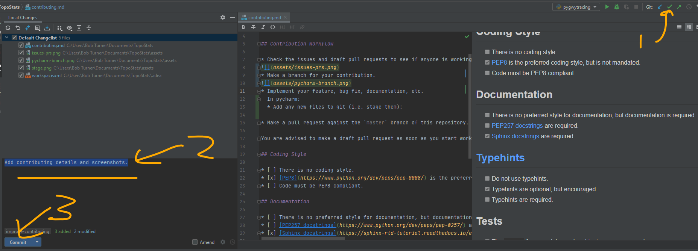
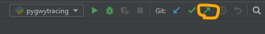
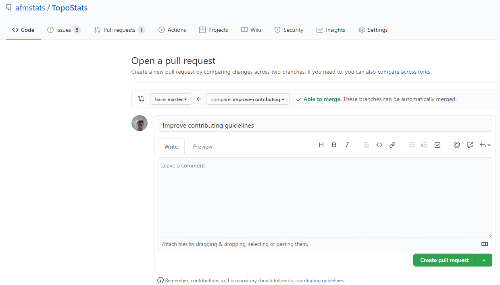

# Contributing

This document explains how, technically, to contribute to this project. A code of conduct may be available in the root
of this repository, or included in the readme.

## Contribution Workflow

- Check the issues and draft pull requests to see if anyone is working on something similar.
- Make a branch for your contribution. If it is a bug fix for the current working version then you should branch from
  `master`. If you are working on new features then please branch from `dev`.
- Implement your feature, bug fix, documentation, etc. using commits.
- Push your changes.
- Make a pull request against the branch from which you originally branched from (`master` for bug fixes; `dev` for new features).

You are advised to make a draft pull request as soon as you start work so nobody else ends up working on the same thing.

## Software Architecture

`topostats` is currently arranged as a Python module in the `topostats/` folder. Other scripts in this repository are
not currently considered core elements of `topostats` apart from `Plotting.py`.

Currently the `topostats` module consists of:

- `default_config.yaml` The default config file.
- `run_topostats.py` The main script for running `topostats` and handles multiprocessing.
- `entry_point.py` Handles the entry point commandline commands.
- `processing.py` Handles processing a single AFM file.
- `filters.py` Handles flattening and pre-processing images.
- `grains.py` Handles grain segmentation.
- `grainstats.py` Calculates statistics for each grain.
- `disordered_tracing.py` Initial tracing of molecules.
- `nodestats.py` Handles any crossings / branches in DNA grains.
- `ordered_tracing.py` Proper tracing of molecules.
- `splining.py` Smooths / splines the traces for a more representative trace.
- `plotting.py` Handles plotting of the data.

The current working plan is to move to a more modular architecture with new (and existing) functionality being grouped
by theme within files. We expect to add such files as:

- `filters.py` Raster image filters (e.g. Gaussian blur).
- `morphology.py` Morphological operations (e.g. identify connected components).
- `curves.py` Operations on vectorised "1D" shapes (e.g. determine curvature).
- `file_io.py` Input and output (e.g. load proprietary AFM data formats).
- `plottingfuncs.py` Output plot functions (e.g. generate various plots for raw and processed AFM datasets).

These can then be called by a "main" routine that performs batch analysis, and functions within them tested in isolation
using `pytest` and reused in arbitrary contexts.

Object oriented approaches will be used where appropriate, but not seen as inherently superior to "functional"
approaches which can be easier to maintain. Existing object orientation will be reviewed with this in mind.

## Coding Style

- [ ] There is no coding style.
- [x] [PEP8](https://www.python.org/dev/peps/pep-0008/) is the preferred coding style, but is not mandated.
- [ ] Code must be PEP8 compliant.

## Documentation

- [ ] There is no preferred style for documentation, but documentation is required.
- [ ] [PEP257 docstrings](https://www.python.org/dev/peps/pep-0257/) are required.
- [x] [Numpy docstrings](https://numpydoc.readthedocs.io/en/latest/format.html) are required.

## [Typehints](https://docs.python.org/3/library/typing.html)

- [ ] Do not use typehints.
- [x] Typehints are optional, but encouraged.
- [ ] Typehints are required.

## Tests

- [x] The [`pytest`](https://docs.pytest.org/en/stable/) framework is used and tests are encouraged.
- [ ] Code must be covered by unit tests. The `pytest` framework is used.

To run tests:

```bash
python -m pytest
```

### Updating tests that use `.csv.bz2` files

Here is an example of how to add / update tests that rely on creating \_.csv.bz2 files:
Place the following in the test before generating/calling the fixture from `conftest.py` in the test arguments, run it, then
comment it out / remove it, then run it again with the fixture and check if the test passes. This generates the data and
saves it such that next time you run the tests, it will get picked up for testing against.

```bash
import pandas as pd
df = pd.DataFrame(quadratic_removed)
df.to_csv("tests/resources/image_random_remove_quadratic.csv.bz2", index=False, header=False)
```

## Static Analysis

- [x] Use [`pylint`](https://pypi.org/project/pylint/) to analyse your code before submission.

## Debug using docker

1. Install vscode.
2. Click "Open a Remote Window".
3. Click "Reopen in container".
4. Run the debugger as normal.

## Using pycharm and GitHub

Check the issues and draft pull requests.



Make a branch for your contribution.



Add any new files to `git` (i.e. stage them).


Commit the changes (with a sensible message).



> Add / commit multiple times to break your contribution into easy to follow chunks.

Push changes.



Make a pull request.


