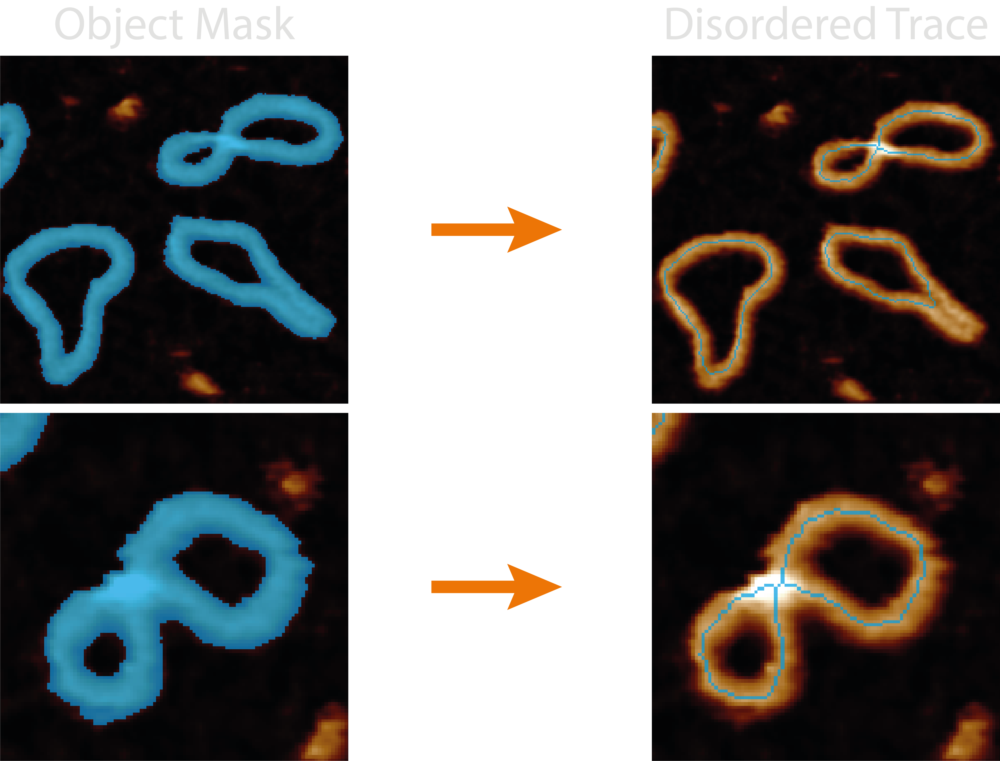

# Disordered Tracing

This section gives an in-depth overview of the steps taken in the disordered tracing module.

## At a Glance : Simple Representations

The `disordered_tracing.py` module handles all the functions associated with obtaining single-pixel wide, line representations of masked objects.

The quality and likeness of the resultant pruned skeleton thus depends on the quality of the mask, the effectiveness of smoothing parameters, the method of skeletonisation, and the quality of automating the pruning of incorrect skeletal branches.

Some quick FYI's:

- **Bad mask, bad skeleton** - If the mask closes holes seen in the image, all skeletonisation methods will produce a single line for this region.
- **No skeletons in image** - The disordered trace `core` image may not show the resultant skeletons if the plotting `dpi` value is too low (varies based on image size).
- **Hard to remove branches** - If there are still spurious branches to prune after modifying the `mask_smoothing_params` and `pruning_params`, try increasing the `filters.gaussian_size` value to smooth the image the mask is based from.

## Processing Steps

### 1. Smoothing the Mask

Generated masks can be quite jagged which causes a large increase in spurious skeletal branches which do not best represent the image. This can be resolved by first smoothing the incoming mask.

> image of smoothed vs unsmoothed result

Smoothing uses either binary dilation (expanding the borders of the mask `dilation_iterations` times) or an otsu threshold applied to a gaussian filtered mask (with a smoothing factor of `gaussian_sigma`). If both values are provided an input in the configuration file, they will compete, and the winning result is the one with the smallest number of added pixels.

The reason for the competition is an attempt to conserve mask topology i.e. any small holes it has which may become closed upon dilation / gaussian blurring. The dilation method seems to work best for larger masks where there are more mask pixels, and the gaussian smoothing better when there are small holes.

In addition, this smoothing step also tries to preserve mask topology by re-adding any holes back into the mask that lie within the `holearea_min_max` threshold. This has the resulting effect of only smoothing the outer edge of the mask.

### 2. Skeletonisation

Skeletonisation is the process of reducing a binary image to a single-pixel wide representation. This can be done using the algorithms provided by [scikit-image](https://scikit-image.org/docs/stable/auto_examples/edges/plot_skeleton.html) such as `zhang` (rule based + errosion), `lee` (connectivity preserving), `medial_axis` (pixels >1 closest boundary pixels), or `topostats` - a modification of Zhang's algorithm which uses the underlying height information to order and then remove only a percentage of the pixels marked for removal by each iteration.

> comparison between skeletonisation algorithms

We have found that by including the height information into the skeletonisation process and removing the lowest `height_bias` percent, we can bias the skeleton to lie on the DNA backbone and generate a better representation of the molecule, especially at crossing points and regions where the mask is less accurate.

> different height bias examples

### 3. Pruning
