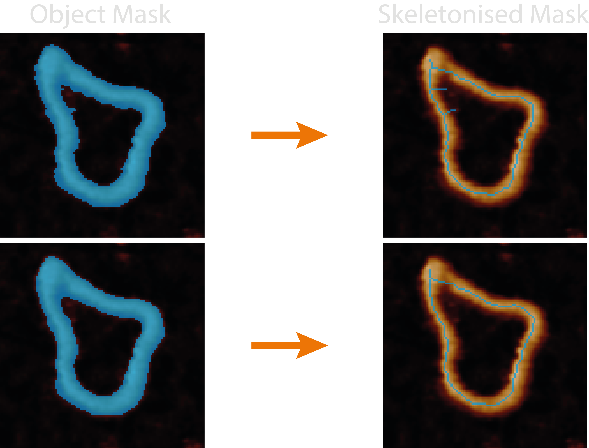
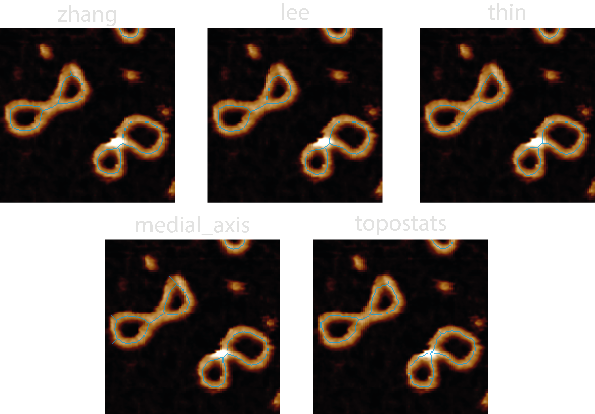
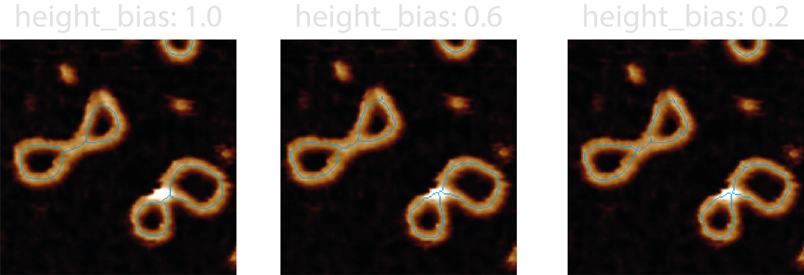
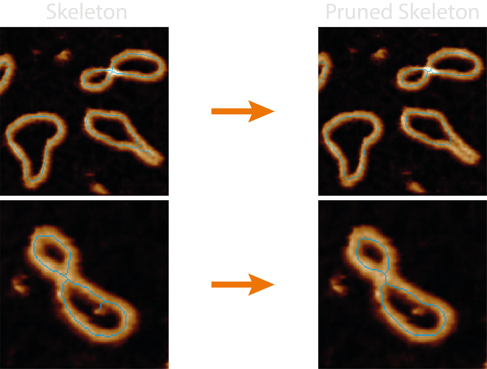
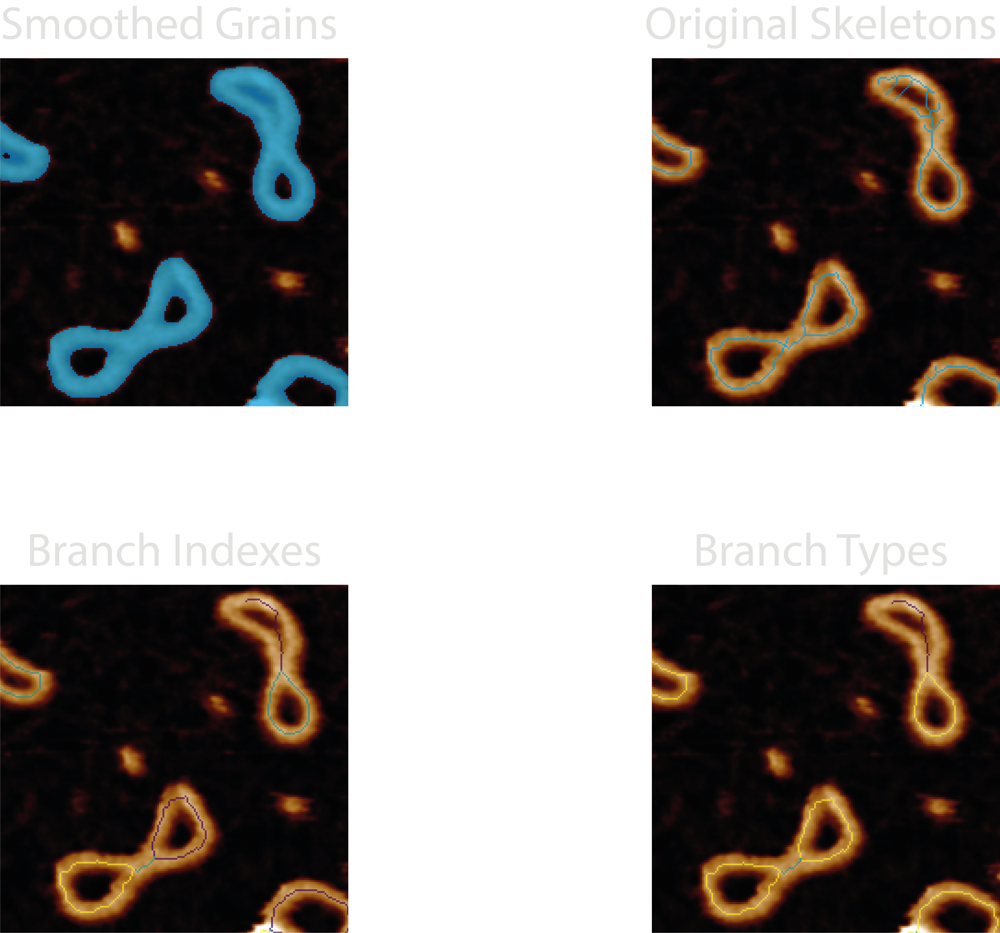

# Disordered Tracing

This section gives an in-depth overview of the steps taken in the disordered tracing module.

## At a Glance : Simple Representations

The `disordered_tracing.py` module handles all the functions associated with obtaining single-pixel wide, line representations of masked objects.

The quality and likeness of the resultant pruned skeleton thus depends on the quality of the mask, the effectiveness of smoothing parameters, the method of skeletonisation, and the quality of automating the pruning of incorrect skeletal branches.

This module measures the number of junctions and endpoints for each pruned skeleton object and appends these columns to the `all_statistics.csv`. In addition, the `all_disordered_segment_statistics.csv` file is produced which measures the length, type, pixel value mean and standard deviation for each skeleton segment between junctions using [Skan](https://skeleton-analysis.org/stable/index.html). The branch types are given by:

- 0: Endpoint-to-endpoint
- 1: Endpoint-to-junction
- 2: Junction-to-junction
- 3: Isolated cycle

Some quick FYI's:

- **Bad mask, bad skeleton** - If the mask closes holes seen in the image, all skeletonisation methods will produce a single line for this region.
- **No skeletons in image** - The disordered trace `core` image may not show the resultant skeletons if the plotting `dpi` value is too low (varies based on image size).
- **Hard to remove branches** - If there are still spurious branches to prune after modifying the `mask_smoothing_params` and `pruning_params`, try increasing the `filters.gaussian_size` value to smooth the image the mask is created from.
- **Masked colours are relative** - Any mask colours that may be produced by plots are relative to the mask values in that image as they will always span the masked colourmap, and will not compare well across images if the range of mask values differ.

## Processing Steps

### 1. Smoothing the Mask

Generated masks can be quite jagged which causes a large increase in spurious skeletal branches which do not best represent the image. This can be resolved by first smoothing the incoming mask.

Smoothing uses either binary dilation (expanding the borders of the mask `dilation_iterations` times) or an otsu threshold applied to a gaussian filtered mask (with a smoothing factor of `gaussian_sigma`). If both values are provided an input in the configuration file, they will compete, and the winning result is the one with the smallest number of added pixels.

The reason for the competition is an attempt to conserve mask topology i.e. any small holes it has which may become closed upon dilation / gaussian blurring. The dilation method seems to work best for larger masks where there are more mask pixels, and the gaussian smoothing better when there are small holes.

In addition, this smoothing step also tries to preserve mask topology by re-adding any holes back into the mask that lie within the `holearea_min_max` threshold. This has the resulting effect of only smoothing the outer edge of the mask.

### 2. Skeletonisation

Skeletonisation is the process of reducing a binary image to a single-pixel wide representation. This can be done using the algorithms provided by [scikit-image](https://scikit-image.org/docs/stable/auto_examples/edges/plot_skeleton.html) such as `zhang` (rule based + erosion), `lee` (connectivity preserving), `medial_axis` (pixels with >1 closest boundary pixels), or `topostats` - a modification of Zhang's algorithm which uses the underlying height information to order and then remove only a percentage of the pixels marked for removal on each skeletonisation iteration. The skeletonisation methods are handled by the `tracing/skeletonize.py` module.

We have found that by including the height information into the skeletonisation process and removing the lowest `height_bias` percent, we can bias the skeleton to lie on the DNA backbone and generate a better representation of the molecule, especially at crossing points and regions where the mask is less accurate.

### 3. Pruning

Pruning is the act of removing spurious branches from a skeleton which does not follow the underlying masks' shape. To this end, TopoStats provides a variety of methods and parameters to help clean up the skeletons.

Pruning can be done by branch length (using the `max_length` configuration parameter) and / or the branch height (using the `height_threshold`, `method_values` and `method_outliers` configuration parameters).

Length pruning is the simplest, iteratively comparing the length (in nm) of each branch containing an endpoint with the `max_length` parameter. If it's length is below this value, it is deemed as a spurious branch and removed, along with any junction pixels until a single-pixel skeleton remains.

Height pruning also iteratively compares the branches pixel values (height) to a `height_threshold` parameter, again, any branch heights which are below this value are pruned. However, as there are multiple pixels in a branch, we provide different methods to obtain a single branch height value for comparison i.e. `method_values`:

- `min` - the minimum value of all the branch pixel values.
- `median`- the median value of all the branch pixel values.
- `mid` - the middle value (averaged if two) of the ordered branch pixels. This is particularly useful for pruning false bridges where the height dips in the middle of the branch.

Additionally, how these branch height values compare to the `height_threshold` is also considered i.e `method_outliers`:

- `abs` - prunes branch values below the absolute value of the `height_threshold`.
- `mean_abs` - prunes branch values below the whole skeleton mean pixel value - absolute threshold. This is useful for non-surface samples or periodic structures e.g. in DNA we expect the mean height to be around 2nm, but high resolution imaging may cause this to dip to 0.8nm (the depth of a major groove), so we'd want to prune branch heights below this.
- `iqr` - prunes branch values below 1.5x inter-quartile range (IQR) of all the branches.
  Height pruning cannot produce more than one skeleton and so avoids breaking up the skeleton into multiple parts.

## Outputs

The `<image>_<threshold>_disordered_trace` image shows the pruned skeletons that are used to obtain the below metrics and passed onto future processing stages.

For each grain, the following new columns are added to the `grainstats.csv` file:

| Column Name           | Description                                                                             | Data Type |
| --------------------- | --------------------------------------------------------------------------------------- | --------- |
| `grain_endpoints`     | The number of pixels designated as endpoints (only 1 neighbour) in the pruned skeleton. | `integer` |
| `grain_junctions`     | The number of pixels designated as junctions (>2 neighbours) in the pruned skeleton.    | `integer` |
| `total_branch_length` | The sum of all branch lengths in the pruned skeleton.                                   | `float`   |

An `all_disordered_segment_statistics.csv` file is produced for each image which measures the following metrics from each segment in each pruned skeleton:

| Column Name         | Description                                                                                                                | Data Type |
| ------------------- | -------------------------------------------------------------------------------------------------------------------------- | --------- |
| `image`             | The image name being processed.                                                                                            | `string`  |
| `threshold`         | The direction of the grain threshold being applied.                                                                        | `string`  |
| `grain_number`      | The number of the grain being processed in the image.                                                                      | `integer` |
| `index`             | The branch index.                                                                                                          | `integer` |
| `branch-distance`   | The distance (in nm) of the branch.                                                                                        | `float`   |
| `branch-type`       | Branch classification of endpoint-to-endpoint (0), endpoint-to-junction (1), junction-to-junction (2), isolated cycle (3). | `integer` |
| `mean-pixel-value`  | The mean of the branch pixel values (height), in nm.                                                                       | `float`   |
| `stdev-pixel-value` | The standard deviation of the branch pixel values (height), in nm.                                                         | `float`   |
| `basename`          | The directory path containing the image.                                                                                   | `string`  |

## Diagnostic Images

Images produced by the `plotting.image_set: all` for this module are:

- `21-smoothed_grains` - The smoothed mask, used to check that the image topology is retained (holes) before skeletonisation.
- `22-original_skeletons` - skeletonised mask, used to ensure the skeletons follow the underlying structures.
- `23-branch_types` - integer mask of the pruned skeleton with branch pixel values matching the `branch-type`. This can be used to count and check if the skeletonisation process correctly identifies the different branch types.

## Possible Uses

This module would lend itself useful for measuring branched structures and may aid the identification of particular regions by filtering-out segments based on their branch type.

We have used this module to identify and measure the length of reverse forks in stalled DNA replication intermediates as these structures should produce closed loops, however, the reverse forks can be identified as branches with endpoints and their metrics identified from the data. It has also been used as part of the pipeline to obtain ordered traces along topologically complex DNA molecules and topological classifications in our paper; [Under or Over? Tracing Complex DNA Topologies with High Resolution Atomic Force Microscopy](https://www.biorxiv.org/content/10.1101/2024.06.28.601212v1).
