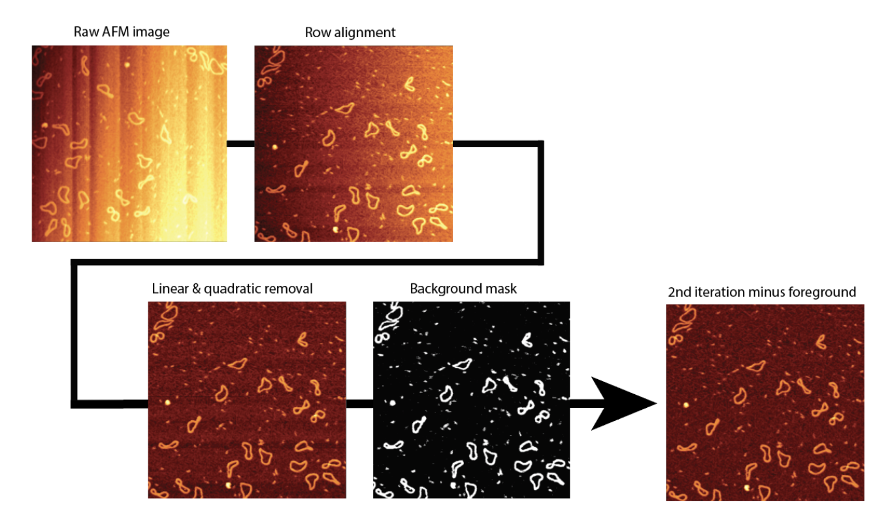
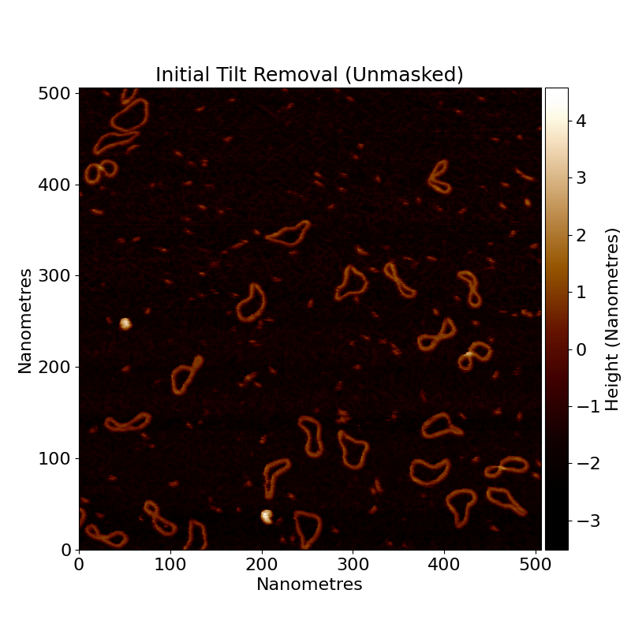
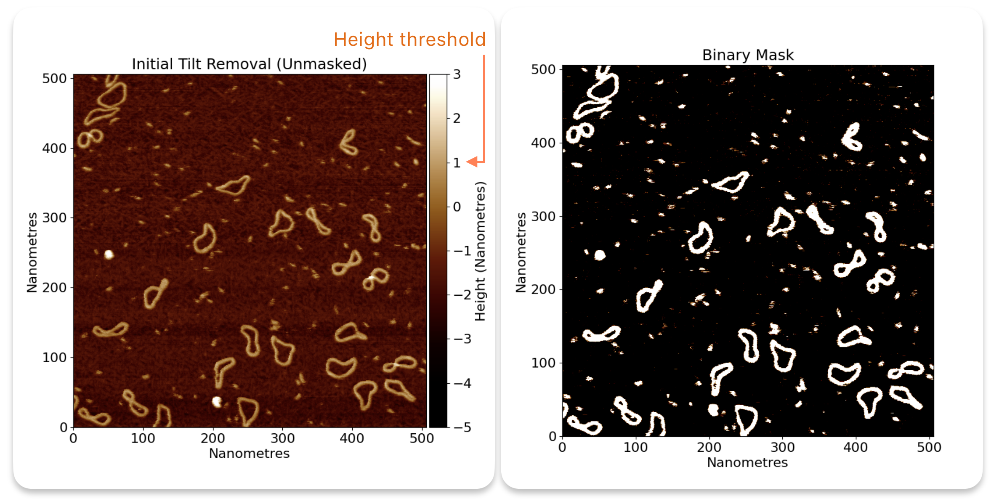
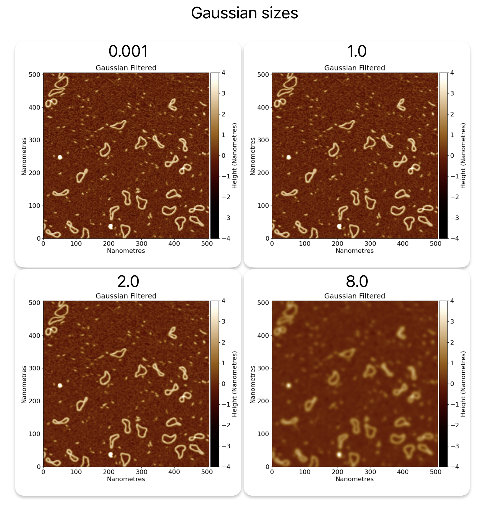

# Flattening

Flattening is the process of taking a raw AFM image, and removing the image artefacts that are present due to the
scanning probe microscopy (SPM) and AFM imaging. These encompass, but are not limited to; row alignment from the raster
scanning motion, and polynomial flattening of a surface from piezoelectric bowing.
For surface based samples, such as DNA on Mica, this results in an image where the background mica is flat and the
sample is clearly visible resting on the surface.

Here is a raw, unprocessed AFM image:

You can see there is a large tilt in the image from the bottom right to the top left, as well as lots of horizontal
banding throughout the rows in the image. These artefacts are removed
during the flattening process in TopoStats knows as `Filters`.

## At a Glance - Removing AFM Imaging Artefacts

Images are processed by:

- Row alignment (make each row median the same height)
- Tilt & polynomial removal (fit a plane and quadratic polynomial to the image and subtract)
- Scar removal (remove long, thin, bright streaks in the data)
- Zero the average height (lower the image by the mean height) to make the background roughly centred at zero nm
- Masking (detect objects on the surface and flatten the image again, ignoring the data on the surface)
- Secondary flattening (re-process the data using the mask to tell us where the background is, and zero the data using
  the mean of the background mask)
- Gaussian filter (to smooth pixel differences / high-gain noise)

## Row alignment

The first step in the flattening process is **row alignment**. Row alignment is a process that adjusts the height of
each row of the image so that they all share the same median height value. This "median" value is set by the
`row_alignment_quartile` where the default of 0.5 is the median value, but can be adjusted depending on how much data
is considered background. This gets rid of some of the horizontal
banding and produces an image where the rows are aligned, but the image still has a clear tilt.

## Tilt removal

After row alignment, tilt removal is applied. This is a simple process of fitting and subtracting a plane to the image,
resulting in a mostly flat image. However as you can see in the following image, it's not perfect and there still
exists "shadows" on rows with lots of non-background data.
Two images are provided here, one with the full z-range and one with an adjusted height range (z-range) to show
the remaining artefacts better, such as the low regions or "shadows" on rows with lots of non-background data.

## Polynomial removal

After the tilt, we remove the polynomial trends. In some images, there is also quadratic or occasionally cubic bowing to
the image too. We remove this by fitting a two dimensional quadratic polynomial to the image (in the horizontal
direction), and subtracting it from the image. We then do the same for a nonlinear polynomial (z = a*x*y) to eliminate
“saddle” trends in the data. We could do all of these at the same time, but we like to be able to see the iterative
differences.

## Scar removal (optional)

We then optionally run scar removal on the image. This is a special function that detects scars - long, thin, bright / dark
streaks in the data, caused by physical problems in the AFM process. They are found by the parameters; `threshold_low`
and `threshold_high` identifying great height changes between rows, and filtered for scars via `max_scar_width`
and `min_scar_length` in pixel lengths. We are using a different image here as an example since our lovely
minicircles.spm image doesn’t have any scars.

**Note that scar removal can distort data, and it’s best to take data without scars if you can.**

## Zero the average height

We then lower the image by its mean height which causes the background of the image to be roughly centred at zero nm.
If this function is provided a foreground mask such as in the second iteration of flattening, this function zeros the
data only on the background data.
Data zeroing is important since the raw AFM heights are relative, and these processing steps can shift the background
height away from zero, so this makes it easier to obtain comparative height metrics.

## Masking

Now consider that all the processing we have done has assumed that every pixel of the image is background. We assumed
that there were no objects on the surface, messing up our fitting, and row alignment. If there was a large amount of
DNA on one side of the image, then the slope will be affected by it, and so flatten the image poorly.

Because of this, once we have done our initial flattening, we detect our objects on the surface, and then flatten the
image again! But this time, ignoring the data on the surface, and only considering the background.

How do we do that?
Well first, we need to find the data on the surface. We do this by thresholding.
The type of threshold (standard deviation - `std_dev`, absolute - `absolute`, otsu - `otsu`), and the threshold values
are set by the config file (have a look!). Any pixels that are below the threshold, are considered
background (sample surface). Any pixels that are above the threshold are considered to be data (useful sample objects).
This binary classification allows us to make a binary mask of where is foreground data, and where is background.

For more information on thresholding and how to set it, see the [thresholding](thresholding.md) page.

Here is the binary mask for minicircle.spm:

So you can see how all the interesting foreground (high) regions are now masked in white, and the background is in
black.

This allows TopoStats to use only the background (black pixels) in its calculations for slope removal, row alignment
etc.

So we re-do all the previous processing, but with this new useful binary mask to guide us.

## Secondary flattening

After re-processing the data using the mask to tell us where the background is, we get a better, more accurately
flattened image. We can see the "shadows" on rows with lots of data have now been flattened correctly.

From here, we can go on to do things like finding our objects of interest (grains) and get stats about them.

## Gaussian filter

Finally, we apply a Gaussian filter to the image to smooth height differences and remove high-gain noise. This allows
you to get smoother data
but will start to blur out important features if you apply it too strongly. The default strength is a sigma of 1.0, but
you can adjust this in the config file under `gaussian_size`. The `gaussian_mode` parameter suggests how values at
the border should be handled, see
[skimage.filters.gaussian](https://scikit-image.org/docs/stable/api/skimage.filters.html#skimage.filters.gaussian)
for more details.

Here are some examples of different gaussian sizes:

