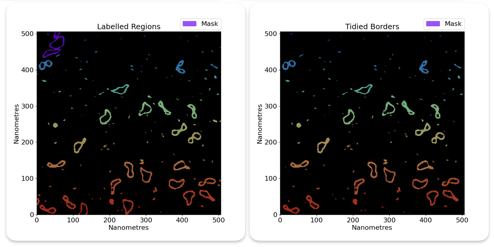
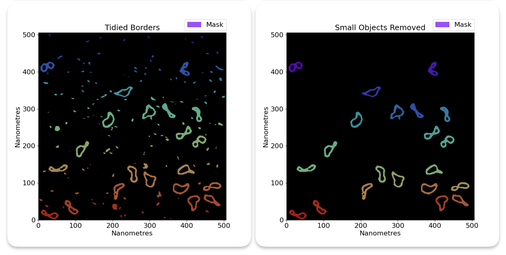
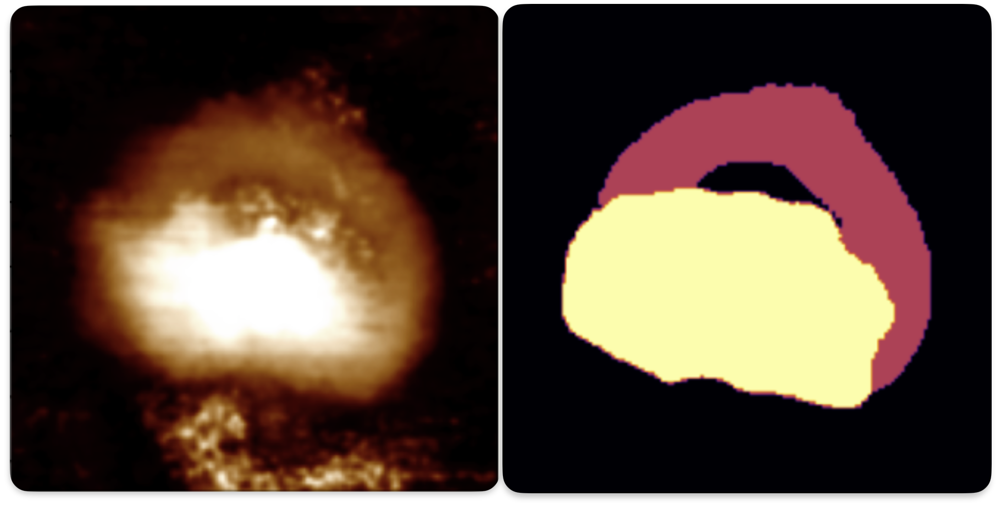

# Grain finding

## At a Glance - Identifying Objects of Interest

TopoStats automatically tries to find grains (objects of interest) in your AFM images. There are several steps to this.

- **Height thresholding**: We find grains based on their height in the image.
- **Remove edge grains**: We remove grains that intersect the image border.
- **Size thresholding**: We remove grains that are too small or too large.
- **Optional: U-Net mask improvement**: We can use a U-Net to improve the mask of each grain.

### Basic Height Thresholding

Grain finding is the process of detecting useful objects in your AFM images. This might be DNA, proteins, holes in a
surface or ridges on a surface.
In the standard operation of TopoStats, the way we find objects is based on a height threshold. This means that we
detect where things are based on how high up they are.

For example, with our example minicircles.spm image, we have DNA that is poking up from the sample surface, represented
by
bright regions in the image, alongside impurities and proteins, also above the surface:

If we want to select the DNA, then we can take only the regions of the image that are above a certain height
threshold (standard deviation - `std_dev`, absolute - `absolute`, otsu - `otsu`).

Here are several thresholds to show you what happens as we increase the absolute height threshold:

Notice that the amount of data decreases, until we are only left with the very highest points.

The aim is to choose a threshold that keeps the data you want, while removing the background and other low objects
that you don’t want including.
So in this example, a threshold of 0.5 would be best, since it keeps the DNA while removing the background.

There are lots of objects in this mask that we don't want to analyse, but we can remove those using area thresholds in
the next steps. These objects have been detectd because while they are small, they are still high up and above the
background.

For more information on the types of thresholding, and how to set them, see the [thresholding](thresholding.md) page.

## Remove edge grains

Some grains may intersect the image border. In these cases, the grain will not be able to have accuracte statistics
calculated for it, since it is not fully in the image. Because of this, we have the option of removing grains that
intersect the image border with the `remove_edge_intersecting_grains` flag in the config file. This simply removes
any grains that intersect the image border.

Here is a before and after example of removing edge grains:

## Size thresholding

In our thresholded image, you will notice that we have a lot of small grains that we do not want to analyse in our
image. We can get rid of those with size thresholding. This is where TopoStats will remove grains based on their area,
leaving only the right size of molecules. You will need to play around with the thresholds to get the right results.

You can set the size threshold using the `absolute_area_threshold` in the config file. This sets the minimum and
maximum area of the grains that you want to keep, in nanometers squared. Eg if you want to keep grains that are between
10nm^2 and 100nm^2, you would set `absolute_area_threshold` to `[10, 100]`.

## Tensors

After basic grain finding is performed in order to identify objects of interest, the grain mask is turned into a tensor.
A tensor is simply a 3D array. In this case, the tensor is the same shape as the AFM image, Width x Height, but with an
added dimension, Class, making the tensor a W x H x C shaped 3D object. Imagine lots of printed out paper sheets stacked
on top of each other to form a block of paper.

This data structure allows us to have multiple masks per image, and so allows for masking of different types of
features, for example DNA and proteins. This is called "multi-class-masking".

Initially, this tensor is just given two binary classes, `0`, and `1`. Class `0` is the background class and is 1 where
there are no grains in the other classes and 0 where there are grains in any of the other classes. Class `1` is simply
the mask produced by the basic grain detection, which usually is designed to be segmenting `DNA` but could really be
anything.

Multi class masking is able to be performed on the existing grains by using a U-Net (a deep-learning feature detection
program) which can optionally be ran after simple grain finding, though needs training.

It is planned to be able to run multiple rounds of traditional thresholding instead of running a U-Net for easier but
less powerful multi-class segmentation implementations.

## Grain Crops

Once the mask has been turned into a tensor, the grains are then cropped from the tensor to produce a mini tensor for
each grain, allowing for easier processing of individual grains. They are stored in `GrainCrop` dataclasses and are held
in a dictionary within a `GrainCropDirection` dataclass instance, which in turn is held in the `ImageGrainCrops`
dataclass instance for the whole image.

For more information on the `ImageGrainCrop`, `GrainCropDirection`, and `GrainCrop` dataclasses, see the [TopoStats API documentation.](https://afm-spm.github.io/TopoStats/main/autoapi/index.html)

## Optional: U-Net mask improvement

As an additional optional step, each grain that reaches this stage can be improved by using a U-Net to mask the grain
again. This requires a U-Net model path to be supplied in the config file.

Each `GrainCrop`'s image crop is passed to a trained U-Net model which makes a prediction for a better mask, which then
replaces the original mask tensor.

Here is an example comparing absolute height thresholding to U-Net masking for one of our projects. The white boxes
indicate regions where the height threhsold performs poorly and is improved by the U-Net mask.

### Multi-class masking

TopoStats supports masking with multiple classes. This means that you could use a U-Net to mask DNA and proteins
separately.

This requires a U-Net that has been trained on multiple classes.

Here is an example of multi-class masking using a U-Net which was used for one of our projects.

## Technical details

### Details: Multi-class masking

Multi class masking is implemented by having each image be a tensor of shape N x N x C, where N is the image size,
and C is the number of classes. Each class is a binary mask, where 1 is the class, and 0 is not the class.
The first channel is background, where 1 is background, and 0 is not background. The rest of the channels
are arbitrary, and defined by how the U-Net was trained, however we conventially recommend that the first class
be for DNA (if applicable) and the next classes for other objects.
