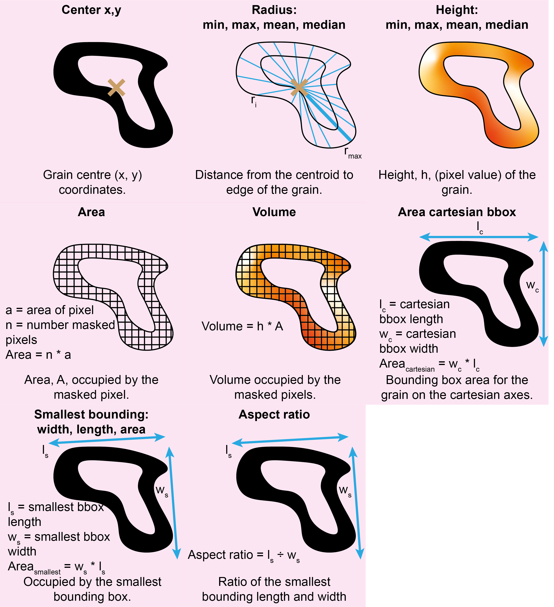
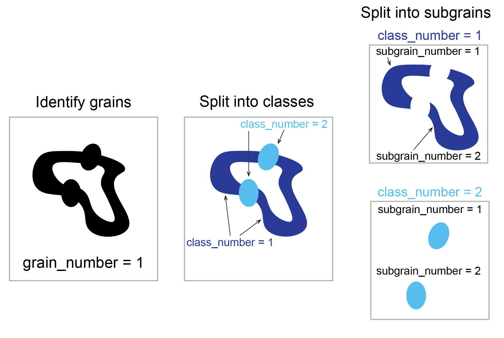

# Grainstats

## At a Glance - Measures Objects

TopoStats automatically measures the grains (objects of interest) found in the grain finding section, in your
AFM images, and outputs them into the `all_statistics.csv` file.

The metrics are briefly summarised in the table below:

| Column Name                      | Description                                                                                                                                                | Data Type |
| -------------------------------- | ---------------------------------------------------------------------------------------------------------------------------------------------------------- | --------- |
| `center_x/y`                     | The center of the grain.                                                                                                                                   | `float`   |
| `radius_min/max/mean/median`     | The distance from the center to each pixel on the perimeter.                                                                                               | `float`   |
| `height_min/max/mean/median`     | The pixel values underlying the grain mask.                                                                                                                | `float`   |
| `area`                           | The area of the pixel-wise grain mask.                                                                                                                     | `float`   |
| `volume`                         | Volume of the pixel-wise grain mask.                                                                                                                       | `float`   |
| `area_cartesian_bbox`            | The area of a box bounding the grain along cardinal directions.                                                                                            | `float`   |
| `smallest_bounding_width/length` | The shortest bounding box length and perpendicular width of the grain in non-cardinal directions.                                                          | `float`   |
| `smallest_bounding_area`         | The area of the smallest possible box bounding the grain.                                                                                                  | `float`   |
| `aspect_ratio`                   | Ratio of the smallest bounding width to smallest bounding length.                                                                                          | `float`   |
| `max/min_feret`                  | The largest and shortest distance of the calipers rotating the grain between calipers. See [feret diameter](https://en.wikipedia.org/wiki/Feret_diameter). | `float`   |

&nbsp;

## The `all_statistics.csv` file

The `all_statistics.csv` file lists metrics for each unique combination of `grain_number`, `class_number`, and `subgrain_number`, described below. Note that `class_number` will always be constant if standard grain finding or a binary U-Net model is used for segmentation, but more classes will be included if multi-class segmentation approaches are used. You can define custom class names within the `grainstats` section of the config file to replace numeric values in the `class_number` column with meaningful labels. This can be particularly useful for downstream analysis of extracted metrics.

| Column Name       | Description                                                                                                                                                              |
| ----------------- | ------------------------------------------------------------------------------------------------------------------------------------------------------------------------ | --- |
| `grain_number`    | Index of the original grain identified through standard grain finding.                                                                                                   |
| `class_number`    | Class assigned during multi-class segmentation.                                                                                                                          |
| `subgrain_number` | Index of the sub-region (subgrain) within a grain for a specific class. If multiple regions of the same class are found in one grain, they are numbered sequentially. |     |

A visual example of the labelling procedure is provided below and is
described in greater depth within `grain_finding` documentation.

