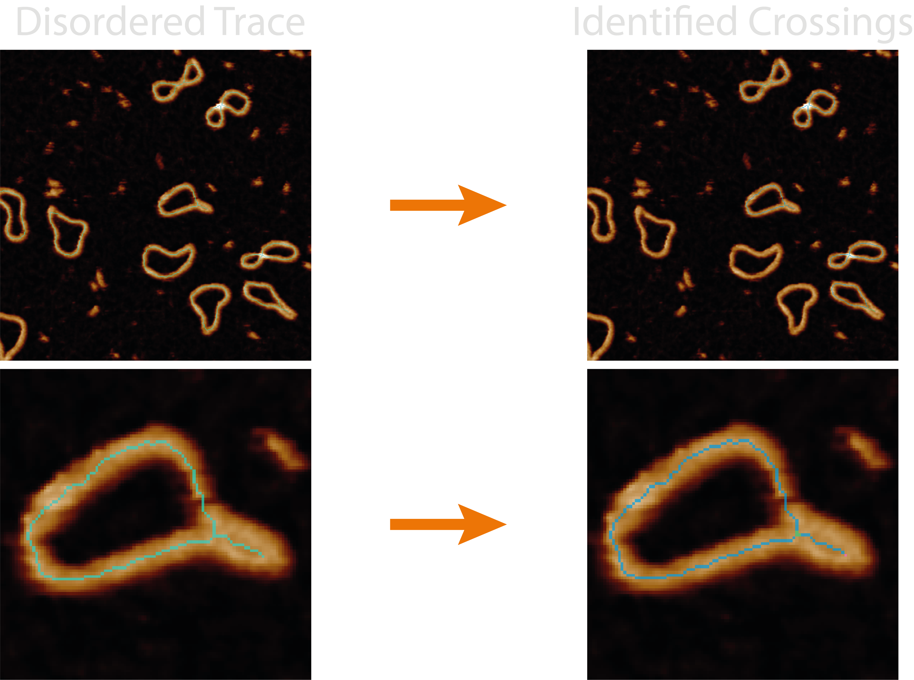
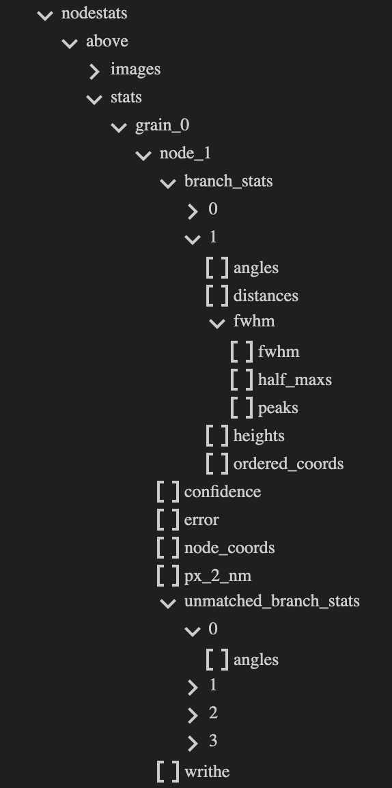
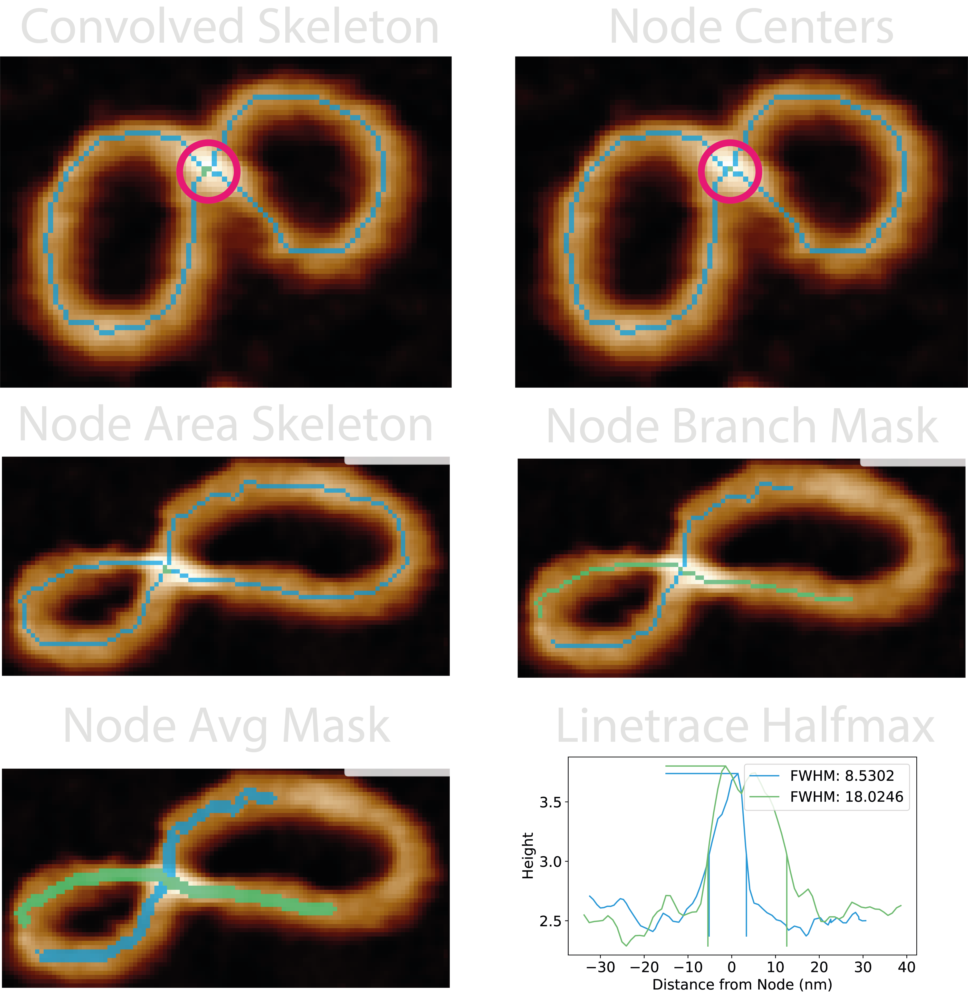

# NodeStats

This section gives an in-depth overview of the steps taken in the NodeStats
module.

## At a Glance : Crossing Analyses

The `nodestats.py` module handles all the functions associated with
identifying and analysing the crossing branches in pruned skeletons.

The quality of the resultant metrics and over/underlying branch classifications
depend on the quality of the pruned skeleton, the effectiveness of automating
the joining of skeleton junction points through the parameters.

This module identifies crossing regions from nearby skeleton junctions and
analyses each branch emanating out from the crossing to pair them, then
determines the overlying and underlying strand using the full-width
half-maximum from each height trace passing through the crossing. It adds the
number of identified crossings and the minimum and average pseudo confidence
values to the `all_statistics.csv`.

Some quick FYI's:

- **Bad skeletons, bad classifications** - If the skeleton does not lie along
  the backbone of the structure, it's resulting height trace and thus stacking
  order calculation may not be accurate.
- **No skeletons in image** - The NodeStats `all` images may not show the
  resultant skeletons if the plotting `dpi` value is too low (varies based
  on image size) as these single pixel lines cannot be resolved by matplotlib.
- **Incorrect pairing** - Pairing of the branches emanating from a crossing is
  based on the assumption that the regions being compared
  (`branch_pairing_length`) are below half the persistence length of the
  material, and as such they should follow straight lines through the crossing
  region.
- **Masked colours are relative** - Any mask colours that may be produced by
  plots are relative to the mask values in that image as they will always span
  the masked colourmap, and will not compare well across images if the range of
  mask values differ.
- **Odd numbered crossings** - These can result from poor masking / pruning and
  are handled by looking further around odd nodes to join them
  (`node_extend_dist`), and if they are still odd, the default behaviour results
  from the `pair_odd_branches` parameter to pair as many as possible leaving one
  remaining, or to not pair any of them.

## Processing Steps

### 1. Identify Skeleton Junctions

The pruned skeletons undergo a 2D convolution with a 3x3 kernel of 1's, and the
skeleton is the remapped onto the resultant image. This produces a non-binary
skeleton where the value of each skeleton pixel is the count of it's
neighbours + 1. This is used to produce a new skeleton image in with pixels
labelled as:
1 - Endpoints
2 - Skeleton segments
3 - Junctions

### 2. Clean-up the Crossing Regions

The alignment of the skeleton onto the crossing backbone is key to obtaining
good analyses from this module, especially for accurate topological
classifications and calculation of writhe signs. For this reason, the area
around the junctions points are re-filled with the mask and skeletonised again.

This has been useful to align the skeletons at branch crossing points however,
the modification to the skeleton has also been known to cause problems as no
additional pruning steps are done.

### 3. Connect the Junctions

Skeleton segments which represent a crossing may not join up perfectly at a
single pixel (junction) and as a result of the skeletonisation procedure, may
be offset from one another and need to be combined to represent the crossing
region or "node". Therefore, junctions closer than the `node_joining_length` of
each other define a crossing region, and the pixels which span between the
junctions along the skeleton are also labelled as a crossing.

Depending on the sample type or skeletonisation / pruning errors, there might
exist an odd number of emanating branches. In DNA samples, we typically see
this where just before a crossing region, the two strands lie close to each
other, creating an elongated crossing in the skeletonisation representation. In
order to capture these for analysis, the `node_extend_dist` tells odd-branch
crossing regions to look for and extend to other odd-branch crossing regions
within this distance.

### 4. Pair the Branches

For each of these crossing regions, the skeletons are reduced to solely a
single crossing and their emanating branches. The part we are interested in,
and obtain traces for are branch regions defined as extending upto the
`branch_pairing_length` away from the central crossing region. This length
should be below half the persistence length of the material, so that the
branches should follow (roughly) straight lines through the crossing region.

This enables us to pair emanating branches based on the angles between their
vectors using bipartite matching to obtain the best pairing combinations to use
for
subsequent steps.

### 5. Height Traces

For each paired branch in the crossing region, we can use a series of dilations
to obtain two more accompanying branches to average our traces across a few
pixels and reduce the error in the skeleton position along the backbone at the
crossing. Using the underlying height values, and calculating the distance
radially (not along the path) from the highest point in the crossing (the node
centre), a height trace of the topographic crossing can be used to find the
full-width half-maximum (FWHM) value of the crossing peak and determine which
crossing branch lies atop (largest value) or beneath (smallest value) the other.

From the FWHM of the height traces, a pseudo confidence value is obtained using
the equation below. It calculates the ratio of the minimum to maximum value
across all FWHM pairs of all crossing branches, N, (using combinatorics to pair
crossing branches if >2):

$$
\text{crossing confidence} = \frac{1}{N} \sum_{\text{FWHM\_pairs}} \left(1 - \frac{\min(\text{FWHM\_pairs})}{\max(\text{FWHM\_pairs})}\right)
$$

## Outputs

The `<image>_<threshold>_nodes` image shows the crossing regions highlighted in
green, skeleton segments in blue, and endpoints in pink.

For each grain, the following new columns are added to the `grainstats.csv`
file:

| Column Name               | Description                                                                                                                                             | Data Type |
| ------------------------- | ------------------------------------------------------------------------------------------------------------------------------------------------------- | --------- |
| `num_crossings`           | The number of crossing regions found in the grain. Note: this will be equal to or lower than the number of junctions explained in the previous section. | `integer` |
| `avg_crossing_confidence` | The average of all pseudo crossing confidences. Used to estimate quality of predictions.                                                                | `integer` |
| `min_crossing_confidence` | The minimum of all pseudo crossing confidences. Used to estimate quality of predictions.                                                                | `float`   |

&nbsp;

Note: Most information obtained during the NodeStats processing can be obtained
from the `<image_name>.topostats` file found within the `processed` folder and
contains a multitude of grain and branch statistics such as:

- number of nodes per grain
- node confidences
- node coordinates
- node writhe sign
- number of branches per node
- branch distance array
- branch height array
- branch FWHM dictionary containing the FWHM, half max, and peak values
- matched and unmatched branch angles

## Diagnostic Images

Images produced by the `plotting.image_set: all` for this module are:

- `25-convolved_skeleton` - The result of the convolution operation described
  in 1. The default "blue_green_pink" colourmap for this image represent
  skeleton segments, junctions, and endpoints respectively.
- `26-node_centres` - The highest pixel in each crossing region (green) with
  the same colourmap as above. This is where the '0' distance point corresponds
  to in the height traces.
- `nodes` folder:
  - `grain_<X>_node_<Y>_node_area_skeleton>` - Contains the reduced area of
    grain number X and node number Y which consists of the node in question and
    only it's emanating branches.
  - `grain_<X>_node_<Y>_node_branch_mask>` - Visualises the crossing branches
    where the length depends on `branch_pairing_length`.
  - `grain_<X>_node_<Y>_node_avg_mask>` - Visualises the dilated crossing
    branches used to obtain an average height trace along the crossing branches.
  - `grain_<X>_node_<Y>_linetrace_halfmax>` - Shows the height trace of each
    crossing branch, and was used to determine the FWHM. The vertical lines show
    the location of where the half-maximum was taken from.

## Possible Uses

This module would lend itself useful for measuring and quantifying complex
overlapping structures, and is a requirement for the `nodestats` method in
`ordered_tracing` which orders the trace along a complex topology.

We have used this module to broadly quantify conformational differences between
relaxed and supercoiled DNA samples based on the number of crossing regions
seen in samples of each grain. Additionally the FWHM results have been used to
confirm the classification topologically complex molecules via the highest
confidence. The branch statistics have been used to identify and
quantify different conformations of topologically complex DNA and the effect
of surface deposition. Finally, splitting the odd-branched nodes enabled us to
identify and measure the replicated and unreplicated DNA segments in
replication intermediates despite their complex writhed path. These analyses
can be seen in our paper;
[Under or Over? Tracing Complex DNA Topologies with High Resolution Atomic Force Microscopy](https://www.biorxiv.org/content/10.1101/2024.06.28.601212v1).
