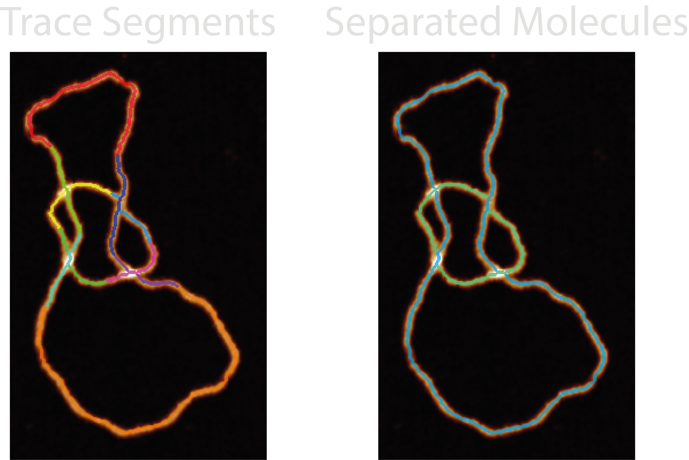

# Ordered Tracing

This section gives an in-depth overview of the steps taken in the ordered tracing module.

## At a Glance : Traversing a Path

The `ordered_tracing.py` module handles all the functions associated with ordering the pixels one-after-another from the
disordered trace (pruned skeleton).

The quality of the resultant metrics and ordered coordinates will depend on the ordering method chosen, whether the
skeleton matches the conformation, and if selected, the performance (pairing) of the branch crossing points in
NodeStats.

This module orders the disordered trace pixel-by-pixel (`topostats` method) or segment-by-segment (`nodestats` method),
giving direction to the trace and creating a path to follow. It adds the number of identified molecules (found by
restarting the trace when using the `nodestats` method) and whether the trace contains endpoints and is therefore
circular or not to the `all_statistics.csv`.

Some quick FYI's:

- **Multiple molecules** - By design the `topostats` ordering method will only produce a single ordered trace per grain,
  however, the `nodestats` method may identify multiple (useful for separating overlapping structures etc).
- **No skeletons in image** - The Ordered Traces `all` image set may not show the resultant skeletons if the plotting
  `dpi` value is too low (varies based on image size) as these single pixel lines cannot be resolved by matplotlib.
- **Circular field not circular** - The grain stats (and molecule stats) field labelled "circular" does not check if the
  path starts and ends at the same place. Instead, it is a True/False indicator of the presence of any endpoints.
- **Failed NodeStats ordering** - If the "nodestats" method is selected in the configurations file and an error occurs
  in the NodeStats module for a particular grain, and that grain isn't added to the noodestats dictionary, it will
  default to "topostats" ordering.
- **Overlapping traces** - Because the crossing region is shared by both crossing strands, the pixels in the mask may
  show a discontinuity in one "leg" of the crossing in the ordered trace image, this is purely visual and does not
  affect the underlying data.

## Processing Steps

### NodeStats Method

#### 1. Compile Segments

The first stage is to use the branch coordinates and disordered trace skeleton to compile a labelled image and
associated set of coordinates and their stacking orders. To do this, the crossing branch coordinates are removed from
the disordered trace and all remaining segments labelled 1 to N. Then, branch-by-branch the crossing coordinates are
replaced with following labels, resulting in an image where each skeleton and crossing segment are labelled.

#### 2. The NodeStats Tracing Loop

The trace aims to use the labelled segments described above to link to the full set of coordinates and build,
segment-by-segment, an ordered path.

It starts by looking for any endpoints, and uses the index of the endpoint segment to start the trace, if there are no
endpoints, the starting index will all ways be the first labelled index (1 in the image, 0 in the coordinate list) -
this also has the advantage of starting from a non-crossing segment. The coordinates are added to the ordered trace and
the currently indexed segment is then removed from the guide image containing all the segments. Then, the maximum value
found in a 3x3 area around the final coordinate in the ordered trace is used to identify the following trace
segment. This repeats until a segment terminates and the only values in that 3x3 area are 0's (background).

If there are no more remaining segments, the trace is finished. However, if any segments remain, a new ordered trace is
started, again from an endpoint segment if possible, hence why this method is able to untangle two interlinked molecules
such as DNA catenanes.

 \*Skeletons dilated for visual aid

#### 2.2. A Simple Trace

While the above is happening, ordered trace segment coordinates are also being added to a simplified ordered trace to be
used with the [Topoly](LINK) package to determine it's topological species. A pseudo Z (height) is used to distinguish
between skeleton segments (Z=0) and crossing segments (Z=-1, 1, 2...). However, these traces (N, X, Y, Z) can be too
long and cause Topoly to hang, so they are reduced to ~100 coordinates. Each reduced points of each segments ensure the
points capture the start and end of each segment.

Topoly then uses this NXYZ coordinate trace to produce a topological classification using Homfly polynomials. In
addition, another trace is built up which flips the stacking order of the lowest confidence crossing to generate a
secondary topology.

- Future work may aim to ensure these reduced segments don't accidentally cross.

#### 2.3. Writhe Sign

The ordered trace and crossing branch coordinates are also used to calculate the writhe of each crossing via the cross
product of the branches normalised vectors, with their direction following the path of the trace. The writhe sign is
calculated as "+" or "-". If a crossing contains > 2 crossing branches, the single crossing region is split into pairs
and the writhe calculated in brackets i.e. "+(-++)"

For overlapping molecules, the writhe signs are still calculated but this is greatly dependent on the directionality of
each molecule. In the case of DNA catenanes, a positive or negative writhe would depend on the relative direction of
each trace. In these cases, the writhe string should only be used to observe relative writhe signs i.e. "++-+" equals
"--+-", as directionality cannot be observed in AFM images.

- Future work may be to separate self and intra-molecule writhes.

### TopoStats Method

#### 1. Classifying Circularity

The TopoStats tracing algorithms slightly differ depending on whether the trace is circular or not. The disordered trace
is defined as circular by counting the number of neighbours of each pixel in the skeleton. If a skeleton contains at
least one skeleton with only one neighbour it is defined as non-circular.

#### 2. Circular and Linear TopoStats Tracing

If the disordered trace is not deemed circular, the trace starts by first finding and selecting an endpoint (pixel with
one neighbour).

If the disordered trace is deemed circular, the trace starts by first finding and selecting a point with two
neighbours. Then, the selected coordinate is added to the ordered path, and deleted from the skeleton. One of the
neighbouring points are randomly selected.

The selected point is then added to the path and deleted from the skeleton enabling the path to then follow the sole
remaining pixel to traverse the path. However, above assumes there is always only one pixel to follow around the path,
but if there are more, the trace will look up to 4 pixels earlier in the ordered trace, and try to identify the next
pixel which has the lowest angular change.

## Outputs

The `<image>_<threshold>_ordered_traces` image shows the direction of ordered coordinates.

For each grain, the following new columns are added to the `grainstats.csv` file:

| Column Name     | Description                                                                                                                                                                                                          | Data Type |
| --------------- | -------------------------------------------------------------------------------------------------------------------------------------------------------------------------------------------------------------------- | --------- |
| `num_molecules` | The number of molecules found by following the tracing paths. Note: This will always be 1 for the TopoStats method.                                                                                                  | `integer` |
| `circular`      | Whether the disordered trace contains an endpoint.                                                                                                                                                                   | `bool`    |
| `writhe_string` | The writhe sign (+/-) which describes the crossing directionality. If a crossing contains > 2 crossing branches, the single crossing region is split into pairs and the writhe calculated in brackets i.e. "+(-++)". | `str`     |

&nbsp;

For each molecule found by the ordering algorithm(s), the following new columns are added to the `molstats.csv` file:

| Column Name     | Description                                                                                                         | Data Type |
| --------------- | ------------------------------------------------------------------------------------------------------------------- | --------- |
| `circular`      | The number of molecules found by following the tracing paths. Note: This will always be 1 for the TopoStats method. | `integer` |
| `topology`      | Whether the disordered trace contains an endpoint.                                                                  | `bool`    |
| `topology_flip` | The number of molecules found by following the tracing paths. Note: This will always be 1 for the TopoStats method. | `integer` |
| `processing`    | The method used for ordering.                                                                                       | `str`     |

&nbsp;

Note: Most information obtained during the Ordered Tracing processing can be obtained from the `<image_name>.topostats`
file found within the `processed` folder and contains a multitude of molecule related objects such as:

- bounding box
- cumulative distance along the trace
- height along the trace
- the ordered coordinates
- molecule statistics explained above
- The writhe sign for each crossing is added to the NodeStats dictionary.

## Diagnostic Images

Images produced by the `plotting.image_set: all` for this module are:

- `27-trace_segments` - The labelled skeleton and crossing segments that the NodeStats trace is built from.
- `28-all_molecule_crossings` - The skeleton, underlying and overlying crossing segments in blue, pink and green
  respectively. The colourmap used is three-tone meaning that middle crossing branches when there are more than two
  branches will appear blue too.
- `29-all_molecules` - A labelled image of all the identified molecules in the grain found by the ordering method. In
  the default colourmap, only three traces will show - blue, green, and pink.

## Possible Uses

This module would lend itself useful for separating overlapping or intertwined structures, and is a requirement for the
`splining` module which smooths the ordered traces to obtain contour lengths of individual molecules.

Additionally, you could use this module and the writhe string obtained to assess the supercoiling degree (via writhe
only, not twist) in DNA samples as well as a preliminary step to obtaining the lengths of the individual molecules.
