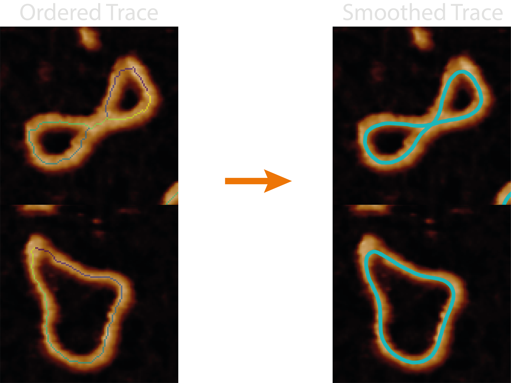
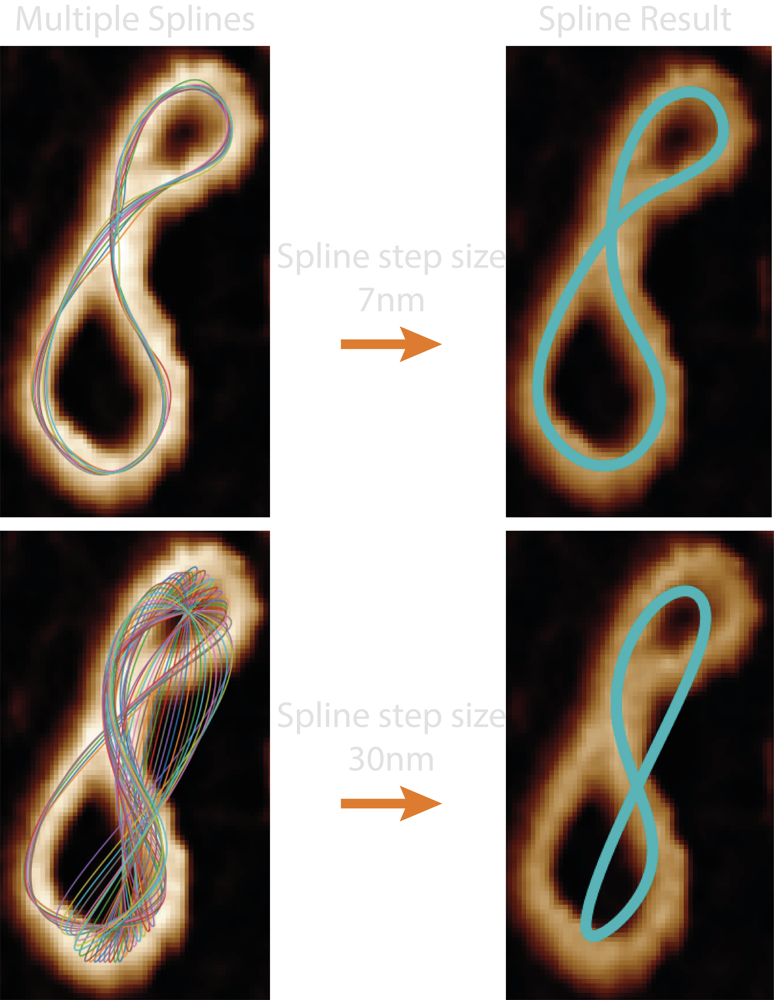
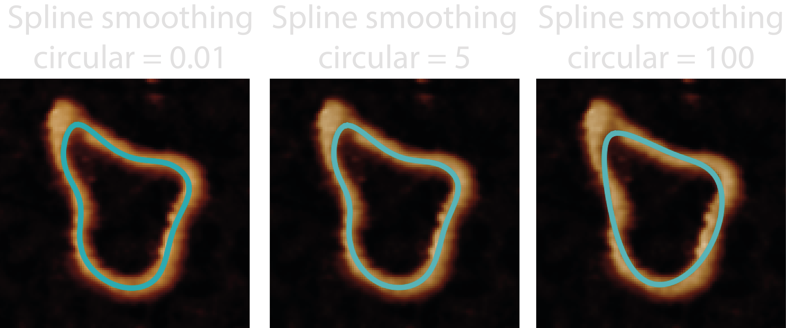
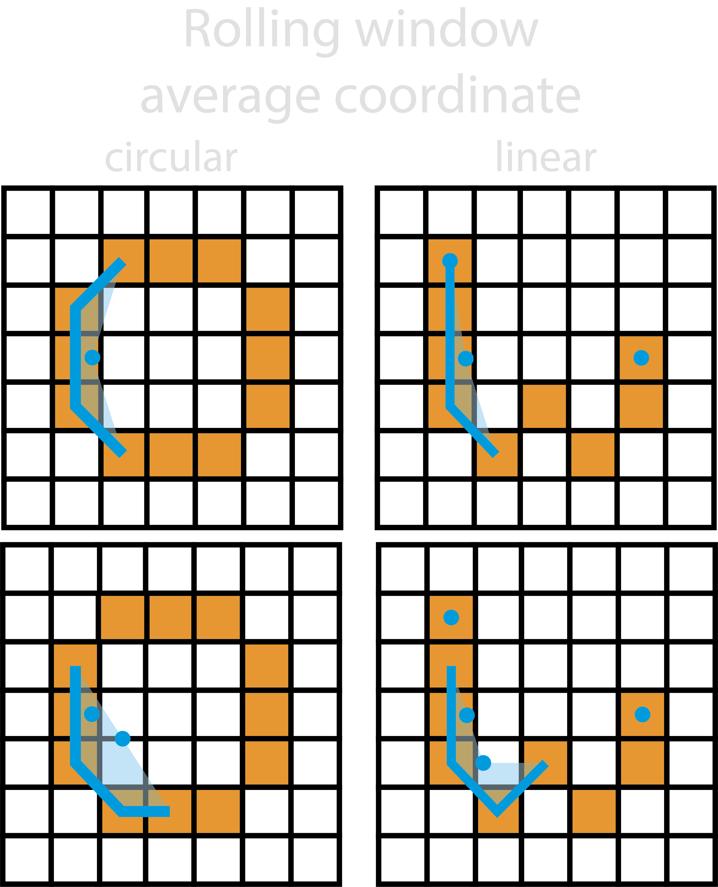
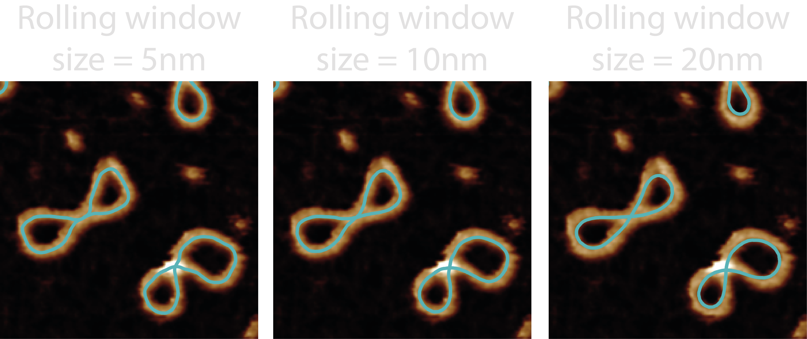
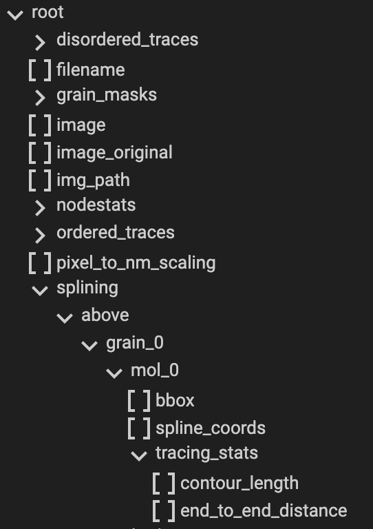

# Splining

This section gives an in-depth overview of the steps taken in the splining module.

## At a Glance : Smoothing Pixelated Traces

The `splining.py` module handles all the functions associated with smoothing
the ordered pixel-wise trace from the "ordered_tracing" step, in order to
produce curves which more closely follow the samples structure.

The quality of the resultant metrics and smoothed coordinates will depend on
the splining method chosen, whether the ordering worked successfully, and
whether the skeleton matches the underlying sample conformation.

This smooths the ordered trace by using an average of splines through the
ordered coordinates (`spline` method) or using the mean coordinate of a rolling
window (`rolling_window` method), helping to resolve length errors in jagged in
the skeletons. It adds the contour length and end-to-end euclidean distance to
the `all_mol_statistics.csv` and the sum and average of these respectively to
the `all_statistics.csv`.

Some quick FYI's:

- **Constricted Traces** - Using the `rolling_window` method with a rolling
  window size that is not far below the persistence length can result in
  over-smoothing where the spline is dragged away from regions of high curvature.
- **Unrepresentative Splines** - The `spline` method's parameters can be quite
  temperamental so it's recommended that `spline_linear_smoothing`,
  `spline_circular_smoothing` and `spline_degree` are not changed unless
  understood.
- **Unrepresentative Splines 2** - The `spline` method may produce unwanted
  results if the `spline_step_size` is too long. This is because the way the
  splines are averaged assumes that each spline point is sampled close to that of
  another's.

## Processing Steps

### Splining Method

#### 1. Trace Coordinate Subsets

The first stage is to use the ordered coordinates and the `spline_step_size`
parameter to define how many splines we want to average together. As the
`spline_step_size` is the distance (in nm) at which to take every i'th
coordinate for its spline. This means the number of splines to average is
calculated below:

$$
N = max(\text{spline step size} \div \text{px to nm}, 1)
$$

The coordinates used for each spline are then obtained from the initial ordered
trace, i.e. the spline coordinate indexes: [1, 2, 3, 4, 1, 2, 3, 4, 1, 2, 3, 4],
where spline 1 takes every 4th coordinate, starting at position 0, then spline 2
takes every 4th coordinate starting at position 1, etc.

#### 2. Obtaining Splines

For each of these coordinate subsets, we use the
[Sci-Py](https://docs.scipy.org/doc/scipy/reference/generated/scipy.interpolate.splprep.html#scipy.interpolate.splprep)
library to find the B-Spline representation of the 2D curve using the smoothness
parameters `spline_linear_smoothing`, `spline_circular_smoothing`, and the
`spline_degree`, found in the configuration file. The `spline_linear_smoothing`
and `spline_circular_smoothing` define the degrees of smoothing for circular or
linear molecules obtained in the Ordered Tracing step, which also tells
TopoStats whether to make the spline periodic if circular. Larger smoothing
values mean more smoothing and smaller values indicate less smoothing. The
`spline_degree` should take odd values, or even with large smoothing. Read more
on the Sci-Py documentation above.

These splines are then averaged together via their index i.e. first spline
coordinates are averaged, then second etc... until a single averaged B-Spline
remain. However, because the splined are averaged on their index, it is assumed
that each index is within close proximity, thus, the `spline_step_size` must be
small enough for this assumption to hold true and for the splining to work as
intended.

### Rolling Window Method

#### 1. Rolling Average

This method simply uses a rolling average of the ordered trace coordinates
within the `rolling_window_size` to produce the new smoothed trace. The
rolling window will move one coordinate along each time, and continues until
the start of the window returns back to its initial position.

For linear smooth traces, the same as above occurs however, the initial and
final coordinates are also added to the smoothed trace as to not drastically
reduce the length of the smoothed trace.

## Outputs

The `<image>_<threshold>_ordered_traces` image shows the direction of ordered
coordinates.

For each grain, the following new columns are added to the `grainstats.csv`
file:

| Column Name                   | Description                                                                               | Data Type |
| ----------------------------- | ----------------------------------------------------------------------------------------- | --------- |
| `total_contour_length`        | The total length along the splined trace of all identified molecules.                     | `float`   |
| `average_end_to_end_distance` | The average distance from two endpoints of the spline of all identified linear molecules. | `float`   |

&nbsp;

For each molecule found by the ordering algorithm(s), the following new columns
are added to the `molstats.csv` file:

| Column Name           | Description                                                           | Data Type |
| --------------------- | --------------------------------------------------------------------- | --------- |
| `contour_length`      | The length along the splined trace of the molecule.                   | `float`   |
| `end_to_end_distance` | The distance from two endpoints of the spline of the linear molecule. | `float`   |

&nbsp;

Note: Most information obtained during the Splining processing can be
obtained from the `<image_name>.topostats` file found within the `processed`
folder and contains a multitude of molecule related objects such as:

- bounding box
- spline coordinates
- tracing statistics of contour length and end to end distance

## Diagnostic Images

There are no diagnostic images produced in this step.

## Possible Uses

This module would lend itself useful for accurately measuring the lengths of
complex objects within samples, and obtaining an accurate representation of the
underlying conformation of the sample.

We have used this module to accurately measure the length of topologically
complex DNA samples such as knots, catenanes, and theata-curves (replication
intermediates). Additionally, we've used the end-to-end distance to measure the
conformational variation of linear DNA in the presence of NDP-52 to show that
it may also play a role in topological regulation.
[See more here.](https://www.nature.com/articles/s41467-023-38572-9).
