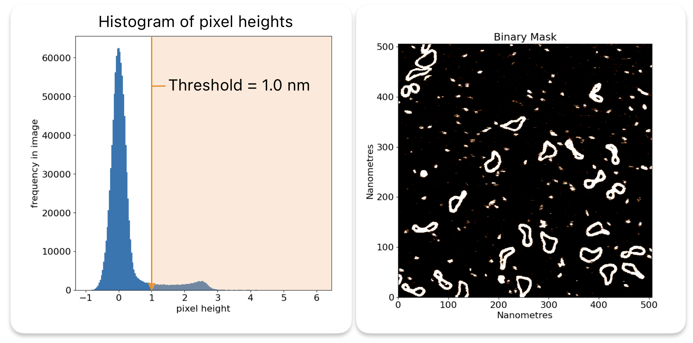

# Thresholding

When flattening images and finding grains, TopoStats uses thresholding to separate the background data from the
foreground data. This is done by setting a threshold value, and classifying all pixels above this value as foreground,
and all pixels below this value as background.

There are several different types of thresholding that can be used, and each has its own advantages and disadvantages.

Below is a histogram showing the heights of the pixels in minicircle.spm after flattening. You can see that most of the
pixels are at a height of 0nm, which is the background. There is a second peak at 2.5nm which is around the height that
we expect DNA to be. The rest of the pixels are noise.

A threshold will select all pixels above a certain height, and ignore the rest, ie the pixels in the orange area.



## Note: Thresholding above and below the surface

TopoStats has the ability to threshold both above the sample surface and below it. This allows finding grains on the
surface but also holes in the surface (useful for silicon wafer analysis). This can be configured by setting the sign
of the thresholds in the config file (+ or -). Eg if you want to find grains above the surface use
a positive threshold value, and vice-versa.

## Setting the threshold in config

Thresholds can be set using the configuration file (`.yaml`). The chosen `threshold_method` determines which of the
threshold values from the config are used (absolute, std_dev, or otsu).

- `threshold_std_dev`
- `threshold_absolute`

Thresholds are defined as lists in the config. These lists can be of any length and do not have to be ordered.
TopoStats will loop through the list and use each threshold one by one to find grains.

The sign of a chosen threshold (+/-) dictates whether the threshold should be applied above or below the surface.

Examples:

`threshold_absolute: [1]`

- This example defines a single threshold, 1, to be used in grain finding. Note that it is still enclosed in a list
  (square brackets)

`threshold_absolute: [1, -1, 1.5]`

- This example has three threshold values, one below and two above. They will be iterated over from left to right when being
  used for grain finding. The order of the thresholds in the list does not matter; this example's values have not been
  sorted to illustrate this.

### Area thresholds

Each threshold needs `area_threshold` values to go along with it, with a low and a high value per threshold.
Again using the examples from above:

```yaml
threshold_absolute: [1]
area_thresholds: [[300, 3000]]
```

As there is only one threshold given area_thresholds only needs one sub-list.

```yaml
threshold_absolute: [1, -1, 1.5]
area_thresholds: [[300, 3000], [300, 3000], [300, 3000]]
```

In this example there is one sublist `[300, 3000]` per given threshold. Thresholds and area thresholds are paired using
their index values (e.g. first `area_threshold` corresponds to the first threshold value and so on).

## Thresholding types

### Standard deviation thresholding

Standard deviation thresholding is a simple method of thresholding that uses the standard deviation of the image to
determine the threshold value. The threshold value is calculated as:

$$
\text{threshold} = \text{mean} + \text{std\_dev} \times \text{factor}
$$

Where `mean` is the mean of the image, `std_dev` is the standard deviation of the image, and `factor` is a user-defined
value that determines how many standard deviations above the mean the threshold should be.

This method is useful when you don't know the exact threshold value(s) you want to use, and when you have a bit of noise
in your image.

### Otsu thresholding

Otsu thresholding is an automatic thresholding method that tries to find the threshold value that minimizes the
intra-class variance of the foreground and background pixels.

We have added a multiplier to the Otsu thresholding method to allow for a more flexible thresholding method. The
threshold value is calculated as:

$$
\text{threshold} = \text{otsu} \times \text{factor}
$$

Where `otsu` is the threshold value calculated by the Otsu method, and `factor` is a user-defined value that allows you
to adjust the threshold value.

This method is useful when you want to automatically find the threshold value, and when you have a clear binomial
distribution of pixels (heights). I.e. separation
between the foreground and background pixels in your image with little noise.

### Absolute thresholding

Absolute thresholding is a simple method of thresholding that uses a user-defined threshold value to separate the
foreground and background pixels.

This method is useful when you know the exact threshold value(s) you want to use, for example if you know your DNA
lies at 2nm above the surface you can set the threshold to 1.5nm to capture the DNA without capturing the
background.
