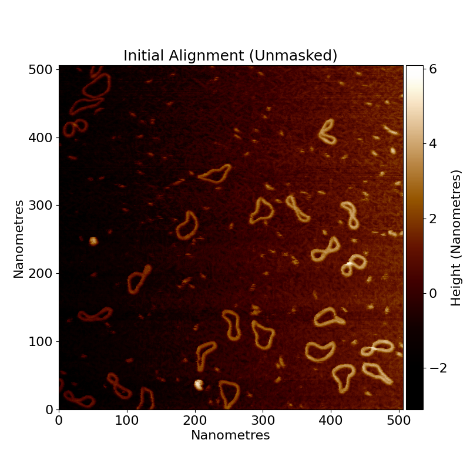

# Flattening

Flattening is the process of taking a raw AFM image, and removing the artefacts that are present in the image,
resulting in an image where the background mica is flat and the sample is clearly visible resting on the surface.

Here is a raw, unprocessed AFM image:

<!--  -->

You can see there is a heavy tilt in the image, as well as a lot of horizontal banding. These artefacts are removed
during the flattening process in TopoStats.

## Row alignment

The first step in the flattening process is **row alignment**. Row alignment is a process that adjusts the height of
each row of the image so that they all share the same median height value. This gets rid of some of the horizontal
banding. This leaves an image where the rows are aligned, but the image still has a clear tilt.

<!--  -->

## Tilt removal

After row alignment, tilt removal is applied. This is a simple process of fitting a plane to the image and subtracting
it, resulting in a mostly flat image, however as you can see in the following image, it's not perfect.

<!--  -->

## Polynomial removal

After the tilt, we remove the polynomial trends. In some images, there is also quadratic or occasionally cubic bowing to
the image too. We remove this by fitting a two dimensional quadratic polynomial to the image (in the horizontal
direction), and subtracting it from the image. We then do the same for a nonlinear polynomial (z = a*x*y) to eliminate
“saddle” trends in the data. We could do all of these at the same time, but we like to be able to see the iterative
differences.

## Scar removal

We then run scar removal on the image. This is a special function that detects scars (long, thin, bright streaks in the
data, caused by physical problems in the AFM process). We are using a different image here since our lovely
minicircles.spm image doesn’t have any scars.

<!--  -->

<!--  -->

**Note that scar removal can distort data, and it’s best to take data without scars if you can.**

## Zero the average height

<!--  -->

We then lower the image by its median height which causes the background of the image to be roughly centred at zero nm.
This is important since both the AFM and these processing steps can cause your background height to not be zero, which
would mean you would get the wrong heights for your data.

## Masking

Now consider that all the processing we have done has assumed that every pixel of the image is background. We assumed
that there were no objects on the surface, messing up our fitting, and row alignment. If there was a large amount of
DNA on one side of the image, then the slope will be affected by it, and so flatten the image poorly.

Because of this, once we have done our initial flattening, we detect our objects on the surface, and then flatten the
image again! But this time, ignoring the data on the surface, and only considering the background.

How do we do that?
Well first, we need to find the data on the surface. We do this by thresholding.
The threshold is set by the config file (have a look!). Any pixels that are below the threshold, are considered
background (sample surface). Any pixels that are above the threshold are considered to be data (useful sample objects).
This binary classification allows us to make a binary mask of where is foreground data, and where is background.

For more information on thresholding and how to set it, see the [thresholding](thresholding.md) page.

Here is the binary mask for minicircle.spm:

<!--  -->

<!--  -->

So you can see how all the interesting high up parts are now masked in white, and the background is in black.

TopoStats can use this to only use the black regions in its calculations for slope removal, row alignment etc.

So we re-do all the previous processing, but with this new useful binary mask to guide us.

## Secondary flattening

After re-processing the data using the mask to tell us where the background is, we get a better, more accurately
flattened image.

From here, we can go on to do things like finding our objects of interest (grains) and get stats about them.

<!--  -->
