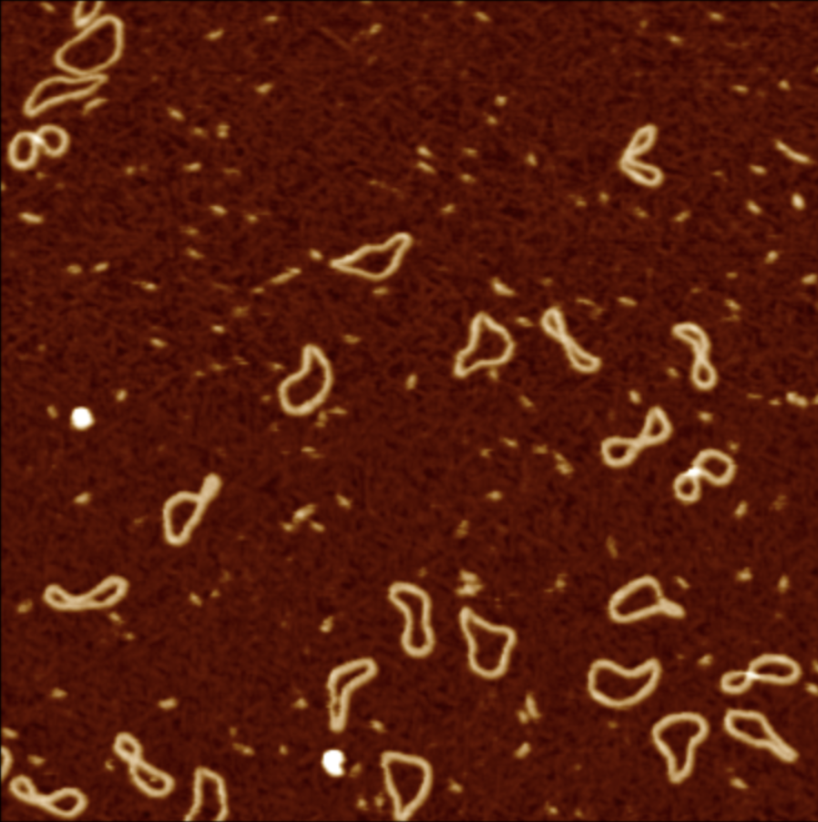
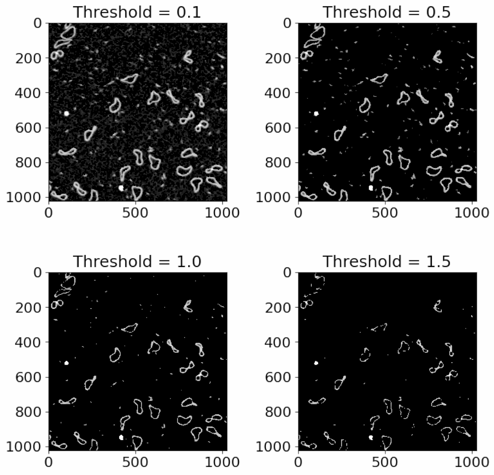
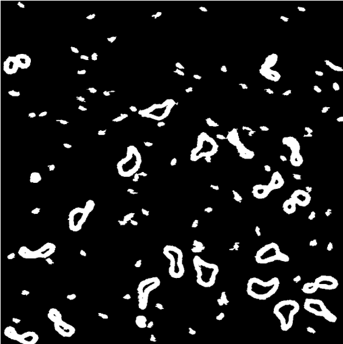
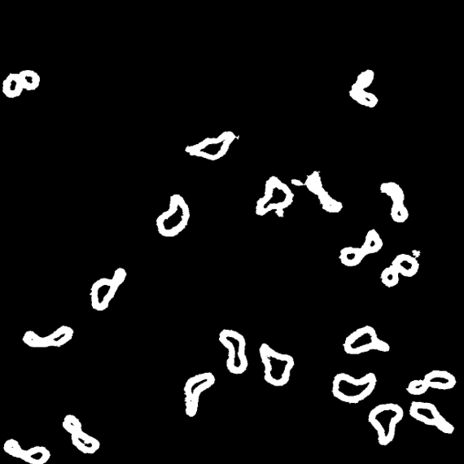

# Grain finding

## Height thresholding

Grain finding is the process of detecting useful objects in your AFM images. This might be DNA, proteins, holes in a
surface or ridges on a surface.
In the standard operation of TopoStats, the way we find objects is based on a height threshold. This means that we
detect where things are based on how high up they are.

For example, with our minicircles.spm image, we have DNA that is poking up from the sample surface, represented by
bright regions in the image:

If we want to select the DNA, then we can take only the regions of the image that are above a certain height
(threshold).

Here are several thresholds to show you what happens as we increase the threshold:

Notice that the amount of data decreases, until we are only left with the very highest points.

The aim is to choose a threshold that keeps the data you want, while removing the background and other low objects
that you don’t want including.
So in this example, a threshold of 0.5 would be best, since it keeps the DNA while removing the background.

## Size thresholding

In our thresholded image, you will notice that we have a lot of small grains that we do not want to analyse in our
image. We can get rid of those with size thresholding. This is where TopoStats will remove grains based on their area,
leaving only the right size of molecules. You will need to play around with the thresholds to get the right results.

