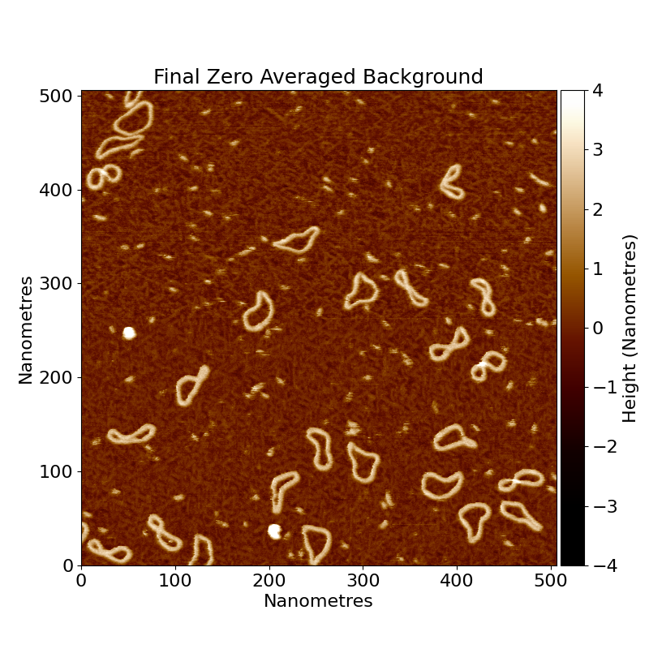

# Grain finding

## Height thresholding

Grain finding is the process of detecting useful objects in your AFM images. This might be DNA, proteins, holes in a
surface or ridges on a surface.
In the standard operation of TopoStats, the way we find objects is based on a height threshold. This means that we
detect where things are based on how high up they are.

For example, with our minicircles.spm image, we have DNA that is poking up from the sample surface, represented by
bright regions in the image:

<!--  -->

If we want to select the DNA, then we can take only the regions of the image that are above a certain height
(threshold).

Here are several thresholds to show you what happens as we increase the threshold:

<!--  -->

Notice that the amount of data decreases, until we are only left with the very highest points.

The aim is to choose a threshold that keeps the data you want, while removing the background and other low objects
that you don’t want including.
So in this example, a threshold of 0.5 would be best, since it keeps the DNA while removing the background.

For more information on the types of thresholding, and how to set them, see the [thresholding](thresholding.md) page.

## Remove edge grains

Some grains may intersect the image border. In these cases, the grain will not be able to have accuracte statistics
calculated for it, since it is not fully in the image. Because of this, we have the option of removing grains that
intersect the image border with the `remove_edge_intersecting_grains` flag in the config file. This simply removes
any grains that intersect the image border.

## Size thresholding

In our thresholded image, you will notice that we have a lot of small grains that we do not want to analyse in our
image. We can get rid of those with size thresholding. This is where TopoStats will remove grains based on their area,
leaving only the right size of molecules. You will need to play around with the thresholds to get the right results.

You can set the size threshold using the `absolute_area_threshold` in the config file. This sets the minimum and
maximum area of the grains that you want to keep, in nanometers squared. Eg if you want to keep grains that are between
10nm^2 and 100nm^2, you would set `absolute_area_threshold` to `[10, 100]`.

<!--  -->

<!--  -->

## Optional: U-Net mask improvement

As an additional optional step, each grain that reaches this stage can be improved by using a U-Net to mask the grain
again. This requires a U-Net model path to be supplied in the config file.

The U-Net model will take the bounding box of each grain, and predict a better mask for it, which then replaces
the original mask.

### Multi-class masking

TopoStats supports masking with multiple classes. This means that you could use a U-Net to mask DNA and proteins
separately.

This requires a U-Net that has been trained on multiple classes.

## Technical details

### Details: Multi-class masking

Multi class masking is implemented by having each image be a tensor of shape N x N x C, where N is the image size,
and C is the number of classes. Each class is a binary mask, where 1 is the class, and 0 is not the class.
The first channel is background, where 1 is background, and 0 is not background. The rest of the channels
are arbitrary, and defined by how the U-Net was trained, however we conventially recommend that the first class
be for DNA (if applicable) and the next classes for other objects.
