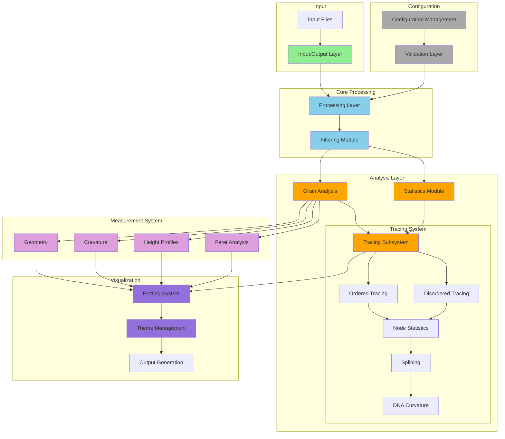

# Workflow

This section gives a broad overview of the workflow and how the different modules interact.

```mermaid
graph TB
    subgraph Input
        IF[Input Files]
        IO["Input/Output Layer"]:::io
    end

    subgraph Configuration
        CM["Configuration Management"]:::config
        VL["Validation Layer"]:::validation
    end

    subgraph "Core Processing"
        PL["Processing Layer"]:::processing
        FM["Filtering Module"]:::filter
    end

    subgraph "Analysis Layer"
        GA["Grain Analysis"]:::analysis
        SM["Statistics Module"]:::analysis

        subgraph "Tracing System"
            TS["Tracing Subsystem"]:::tracing
            OT["Ordered Tracing"]
            DT["Disordered Tracing"]
            NS["Node Statistics"]
            SP["Splining"]
            DC["DNA Curvature"]
        end
    end

    subgraph "Measurement System"
        GM["Geometry"]:::measure
        CM2["Curvature"]:::measure
        HP["Height Profiles"]:::measure
        FA["Feret Analysis"]:::measure
    end

    subgraph "Visualization"
        PS["Plotting System"]:::viz
        TM["Theme Management"]:::viz
        OUT["Output Generation"]
    end

    IF --> IO
    IO --> PL
    CM --> VL
    VL --> PL
    PL --> FM
    FM --> GA
    FM --> SM
    GA --> TS
    SM --> TS

    TS --> OT
    TS --> DT
    OT --> NS
    DT --> NS
    NS --> SP
    SP --> DC

    GA --> GM
    GA --> CM2
    GA --> HP
    GA --> FA

    GM --> PS
    CM2 --> PS
    HP --> PS
    FA --> PS
    TS --> PS
    PS --> TM
    TM --> OUT

    classDef io fill:#90EE90
    classDef config fill:#A9A9A9
    classDef processing fill:#87CEEB
    classDef filter fill:#87CEEB
    classDef analysis fill:#FFA500
    classDef tracing fill:#FFA500
    classDef measure fill:#DDA0DD
    classDef viz fill:#9370DB
    classDef validation fill:#A9A9A9

    click IO "https://github.com/AFM-SPM/TopoStats/blob/main/topostats/io.py"
    click PL "https://github.com/AFM-SPM/TopoStats/blob/main/topostats/processing.py"
    click FM "https://github.com/AFM-SPM/TopoStats/blob/main/topostats/filters.py"
    click GA "https://github.com/AFM-SPM/TopoStats/blob/main/topostats/grains.py"
    click SM "https://github.com/AFM-SPM/TopoStats/blob/main/topostats/statistics.py"
    click TS "https://github.com/AFM-SPM/TopoStats/tree/main/topostats/tracing/"
    click CM "https://github.com/AFM-SPM/TopoStats/blob/main/topostats/default_config.yaml"
    click VL "https://github.com/AFM-SPM/TopoStats/blob/main/topostats/validation.py"
    click GM "https://github.com/AFM-SPM/TopoStats/blob/main/topostats/measure/geometry.py"
    click CM2 "https://github.com/AFM-SPM/TopoStats/blob/main/topostats/measure/curvature.py"
    click HP "https://github.com/AFM-SPM/TopoStats/blob/main/topostats/measure/height_profiles.py"
    click FA "https://github.com/AFM-SPM/TopoStats/blob/main/topostats/measure/feret.py"
    click PS "https://github.com/AFM-SPM/TopoStats/blob/main/topostats/plotting.py"
    click TM "https://github.com/AFM-SPM/TopoStats/blob/main/topostats/theme.py"
```

Generated using [GitDiagram](https://gitdiagram.com/)
